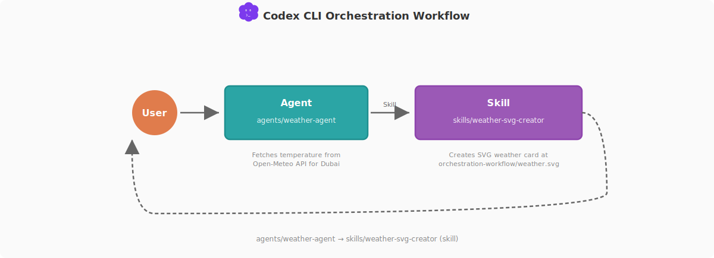

# codex-cli-best-practice
practice makes codex perfect

-white?style=flat&labelColor=555) <a href="https://github.com/shanraisshan/codex-cli-best-practice/stargazers"></a>

[](best-practice/) [](.codex/) [](orchestration-workflow/orchestration-workflow.md) <br>
 = Agents ·  = Commands ·  = Skills

<p align="center">
  
</p>

## 개념

| 기능 | 위치 | 설명 |
|---------|----------|-------------|
|  [**Commands**](https://developers.openai.com/codex/cli/slash-commands) | `custom not supported` | Custom commands(`.codex/commands/`)는 아직 지원되지 않습니다. 현재 29개의 built-in slash commands가 있으며 `/plan`, `/skills`, `/fast`, `/fork`, `/review`, `/apps`, `/agent`, `/model`, `/personality`, `/ps`, `/debug-config` 등이 포함됩니다 |
|  [**Subagents**](https://developers.openai.com/codex/subagents) | [`.codex/agents/<name>.toml`](.codex/agents/) | [](best-practice/codex-subagents.md) [](.codex/agents/) `[agents.<name>]` 아래에 등록하는 custom agents입니다. 전용 TOML 역할 설정, CSV 배치 처리, multi-agent orchestration을 지원하며 built-in은 `default`, `worker`, `explorer`입니다 |
|  [**Skills**](https://developers.openai.com/codex/skills) | [`.agents/skills/<name>/SKILL.md`](.agents/skills/) | [](best-practice/codex-skills.md) [](.agents/skills/) [Reference](docs/SKILLS.md) YAML frontmatter를 갖는 재사용 가능한 instruction package입니다. `/skill-name`으로 호출하거나 에이전트에 preload할 수 있습니다. Built-in은 `$plan`, `$skill-creator`, `$web-search`이며 [Plugins](https://developers.openai.com/codex/plugins)로 배포할 수 있습니다 |
| [**Plugins**](https://developers.openai.com/codex/plugins) | `.codex-plugin/plugin.json` | skills, app integrations, MCP servers를 묶어 배포하는 번들입니다. 로컬/개인용 [marketplace](https://developers.openai.com/codex/plugins/build) 시스템을 사용하며 built-in은 `$plugin-creator`입니다. `/plugins` 또는 Codex App에서 탐색할 수 있습니다 |
| [**Workflows**](https://developers.openai.com/codex/workflows/) | [`.codex/agents/weather-agent.toml`](.codex/agents/weather-agent.toml) | [](orchestration-workflow/orchestration-workflow.md) 코드베이스 설명, 버그 수정, 테스트 작성, 스크린샷 기반 프로토타이핑, UI 반복 개선, cloud 위임, 코드 리뷰, 문서 업데이트 같은 end-to-end 사용 패턴입니다 |
| [**MCP Servers**](https://developers.openai.com/codex/mcp) | `config.toml` → `[mcp_servers.*]` | [](best-practice/codex-mcp.md) [](.codex/config.toml) 외부 도구 연결을 위한 Model Context Protocol입니다. STDIO와 Streamable HTTP 서버를 지원하고 OAuth도 사용할 수 있습니다 (`codex mcp login`) |
| [**Config**](https://developers.openai.com/codex/config-basic) | [`.codex/config.toml`](.codex/config.toml) | [](best-practice/codex-config.md) [](.codex/config.toml) TOML 기반 layered config 시스템입니다. [Profiles](https://developers.openai.com/codex/config-basic), [Sandbox](https://developers.openai.com/codex/cli/features), [Approval Policy](https://developers.openai.com/codex/cli/features), [Advanced](https://developers.openai.com/codex/config-advanced) 설정(`[features]`, `[otel]`, `[shell_environment_policy]`, `[tui]`, model providers, granular approvals)을 포함합니다 |
| [**Rules**](https://developers.openai.com/codex/rules) | `.codex/rules/` | 명령 실행 정책을 정의하는 Starlark 기반 규칙입니다. `allow`, `prompt`, `forbidden` 판단을 패턴 매칭으로 정의하고 `codex execpolicy check`로 테스트할 수 있습니다. 개인 오버라이드는 [AGENTS.override.md](https://developers.openai.com/codex/guides/agents-md)를 사용합니다 |
| [**AGENTS.md**](https://developers.openai.com/codex/guides/agents-md) | [`AGENTS.md`](AGENTS.md) | [](best-practice/codex-agents-md.md) Codex CLI를 위한 프로젝트 수준 컨텍스트 문서입니다. cwd에서 repo root까지 계층적으로 탐색하며 `project_doc_max_bytes` 기준으로 32 KiB 제한이 있습니다. 개인 오버라이드는 `AGENTS.override.md`를 사용합니다 |
| [**Hooks**](https://developers.openai.com/codex/hooks)  | [`.codex/hooks.json`](.codex/) | [](best-practice/codex-hooks.md) [](https://github.com/shanraisshan/codex-cli-hooks) agentic loop에 주입되는 사용자 정의 셸 스크립트입니다. 로깅, 보안 스캔, 검증, 자동화를 위해 사용하며 `codex_hooks = true` feature flag가 필요합니다 |
| [**Speed**](https://developers.openai.com/codex/speed) | `config.toml` → `service_tier` | gpt-5.4에서 Fast Mode를 사용하면 속도는 1.5배, 크레딧 사용량은 2배입니다. `/fast on\|off\|status`로 전환할 수 있으며, Pro 구독자는 GPT-5.3-Codex-Spark로 매우 빠른 반복 작업을 할 수 있습니다 |
| [**Multi-Agent**](https://developers.openai.com/codex/multi-agent/) | `config.toml` → `[agents]` | 특화된 sub-agent를 병렬로 띄워 fan-out 작업, 결과 수집, 종합을 수행합니다. `max_threads` 기본값은 6, `max_depth` 기본값은 1이며, 현재는 기본적으로 `multi_agent = true`입니다 |
| **AI Terms** | | [](https://github.com/shanraisshan/claude-code-codex-cursor-gemini/blob/main/reports/ai-terms.md) Agentic Engineering · Context Engineering · Vibe Coding |
| [**Best Practices**](https://developers.openai.com/codex/learn/best-practices) | | 공식 best practices 문서입니다. [Prompt Engineering](https://platform.openai.com/docs/guides/prompt-engineering), [Codex Guides](https://developers.openai.com/codex/overview)도 함께 참고할 수 있습니다 |

[](orchestration-workflow/orchestration-workflow.md)

[orchestration-workflow](orchestration-workflow/orchestration-workflow.md)에서  **Agent** →  **Skill** 패턴의 구현 상세를 확인할 수 있습니다. 에이전트가 Open-Meteo에서 기온을 가져오고 SVG creator skill을 호출합니다.

<p align="center">
  
</p>


```bash
codex
> Fetch the current weather for Dubai in Celsius and create the SVG weather card output using the repo.
```

> **참고:** 이 워크플로우는 [Claude Code Best Practice](https://github.com/shanraisshan/claude-code-best-practice)의 orchestration workflow와 100% 일치하지는 않습니다. Codex CLI는 아직 custom commands(`.codex/commands/`)를 지원하지 않으므로, 전체  **Command** →  **Agent** →  **Skill** 패턴은 구현할 수 없습니다. Codex App Server 문서에는 실험적인 `tool/requestUserInput`가 있고 codex-cli 0.115.0에는 개발 중인 feature flag 뒤에 내부 `request_user_input` 기능이 있지만, 둘 다 아직 공개되지 않았습니다.

## 개발 워크플로우
- [Cross-Model Claude Code + Codex](https://github.com/shanraisshan/claude-code-best-practice/blob/main/development-workflows/cross-model-workflow/cross-model-workflow.md) [](https://github.com/shanraisshan/claude-code-best-practice/blob/main/development-workflows/cross-model-workflow/cross-model-workflow.md)

## 팁과 트릭


■ **Planning (2)**
- 명시적인 계획이 필요할 때 [`/plan`](https://developers.openai.com/codex/cli/slash-commands)을 사용합니다. Codex가 다단계 작업에서 자동으로 계획할 수도 있습니다
- 실행 전에 [cross-model](https://github.com/shanraisshan/claude-code-best-practice/blob/main/development-workflows/cross-model-workflow/cross-model-workflow.md) 방식으로 계획을 검토합니다. 예: Claude Code

■ **Workflows (8)**
- [`AGENTS.md`](https://developers.openai.com/codex/guides/agents-md)는 간결하게 유지합니다. 150줄은 유용한 기준이며 실제 제한은 바이트 기반입니다
- 자동 발견을 위해 `name`과 `description` 프론트매터가 명확한 [skills](https://developers.openai.com/codex/skills)를 사용합니다
- 팀에 영향을 주지 않는 개인 선호는 [`AGENTS.override.md`](https://developers.openai.com/codex/rules)로 관리합니다
- 프로젝트에서 정의한 안전 수준 전환에는 [profiles](https://developers.openai.com/codex/config-basic)를 사용합니다. 이 저장소에서는 `conservative`와 `trusted`가 예시입니다
- built-in skill creator로 새 스킬을 스캐폴딩하고, 저장소 전반에서 호출 스타일을 일관되게 문서화합니다
- [`on-request`](https://developers.openai.com/codex/cli/features) 승인 정책으로 시작하고, 충분히 확신이 있을 때만 `never`로 올립니다
- [`--fork`](https://developers.openai.com/codex/cli/features)로 현재 세션을 잃지 않고 대안을 탐색하고, [`--resume`](https://developers.openai.com/codex/cli/features)로 이어서 작업합니다
- 작업이 끝나는 즉시 자주 커밋합니다

■ **Workflows Advanced (4)**
- 병렬 fan-out 작업에는 [multi-agent](https://developers.openai.com/codex/multi-agent/)로 sub-agent를 사용합니다. 현재는 기본 활성화된 GA 기능입니다
- headless/CI 파이프라인에는 [`codex exec`](https://developers.openai.com/codex/noninteractive)를 사용합니다
- [sandbox modes](https://developers.openai.com/codex/cli/features)와 [approval policies](https://developers.openai.com/codex/cli/features)를 함께 조합합니다. 기본값으로는 `workspace-write` + `on-request`가 적절합니다
- 병렬 개발에는 [git worktrees](https://git-scm.com/docs/git-worktree)를 사용합니다

■ **Debugging (4)**
- 더 나은 디버깅을 위해 로그를 보고 싶은 터미널은 항상 Codex에게 background task로 실행하게 합니다
- 브라우저 콘솔 로그를 Codex가 직접 볼 수 있도록 MCP([Chrome DevTools](https://developer.chrome.com/blog/chrome-devtools-mcp), [Playwright](https://github.com/microsoft/playwright-mcp))를 사용합니다
- 문제에 막혔을 때는 스크린샷을 찍어 Codex와 공유하는 습관을 들입니다
- QA에는 다른 모델을 사용합니다. 예: 계획과 구현 리뷰용 [Claude Code](https://github.com/shanraisshan/claude-code-best-practice)

■ **Utilities (4)**
- IDE 대신 [iTerm](https://iterm2.com/) 터미널을 사용합니다. 충돌 이슈를 피하기 위함입니다
- 음성 프롬프팅에는 [Wispr Flow](https://wisprflow.ai)를 사용합니다. 생산성이 크게 올라갑니다
- Codex 피드백에는 [codex-cli-hooks](https://github.com/shanraisshan/codex-cli-hooks)를 사용합니다
- 개인화된 사용 경험을 위해 [profiles](https://developers.openai.com/codex/config-basic), [sandbox modes](https://developers.openai.com/codex/cli/features), [MCP](https://developers.openai.com/codex/mcp) 같은 `config.toml` 기능을 탐색합니다

■ **Daily (2)**
- Codex CLI를 매일 업데이트하고, 하루를 [changelog](https://github.com/openai/codex/releases) 확인으로 시작합니다
- X에서 [Tibo](https://x.com/thsottiaux), [Embiricos](https://x.com/embirico), [Jason](https://x.com/jxnlco), [Romain](https://x.com/romainhuet), [Dominik](https://x.com/dkundel), [Fouad](https://x.com/fouadmatin), [Bolin](https://x.com/bolinfest), [OpenAI Devs](https://x.com/OpenAIDevs)를 팔로우합니다


- Codex CLI — open-source local coding agent, first look (Fouad + Romain) | Apr 2025 ● [Tweet](https://x.com/OpenAIDevs/status/1912556874211422572)
- AMA with Codex team — CLI, sandbox, agents (Embiricos, Fouad, Tibo + team) | May 2025 ● [Reddit](https://www.reddit.com/r/ChatGPT/comments/1ko3tp1/ama_with_openai_codex_team/)
- Skills in Codex — standardizing .agents/skills across agents (Embiricos) | Feb 2026 ● [Tweet](https://x.com/embirico/status/2002102889653924111)
- Unrolling the Codex agent loop — how Codex works internally (Bolin) | Jan 2026 ● [Tweet](https://x.com/OpenAIDevs/status/2014794871962533970)
- How Codex is built — 90% self-built in Rust (Tibo, Pragmatic Engineer) | 17 Feb 2026 ● [Post](https://newsletter.pragmaticengineer.com/p/how-codex-is-built)
- Dogfood — Codex team uses Codex to build Codex (Tibo, Stack Overflow) | 24 Feb 2026 ● [Podcast](https://stackoverflow.blog/2026/02/24/dogfood-so-nutritious-it-s-building-the-future-of-sdlcs/)
- Why humans are AI's biggest bottleneck — Codex product vision (Embiricos, Lenny's) | Feb 2026 ● [Podcast](https://www.lennysnewsletter.com/p/why-humans-are-ais-biggest-bottleneck)
- How Codex team uses their coding agent (Tibo + Andrew, Every) | 18 Feb 2026 ● [Podcast](https://every.to/podcast/transcript-how-openai-s-codex-team-uses-their-coding-agent)

<a href="https://github.com/shanraisshan/claude-code-best-practice#billion-dollar-questions"></a>

## 다른 저장소

<a href="https://github.com/shanraisshan/codex-cli-hooks"></a> <a href="https://github.com/shanraisshan/codex-cli-hooks"><strong>codex-cli-hooks</strong></a> · <a href="https://github.com/shanraisshan/claude-code-best-practice"></a> <a href="https://github.com/shanraisshan/claude-code-best-practice"><strong>claude-code-best-practice</strong></a> · <a href="https://github.com/shanraisshan/claude-code-hooks"></a> <a href="https://github.com/shanraisshan/claude-code-hooks"><strong>claude-code-hooks</strong></a>

---

<a href="https://openai.com/form/codex-for-oss/"></a>
